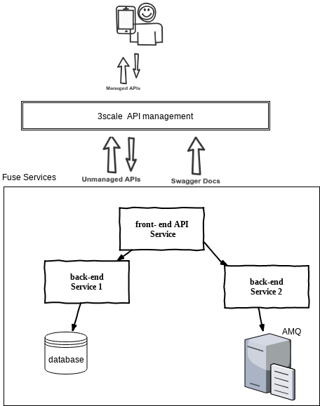
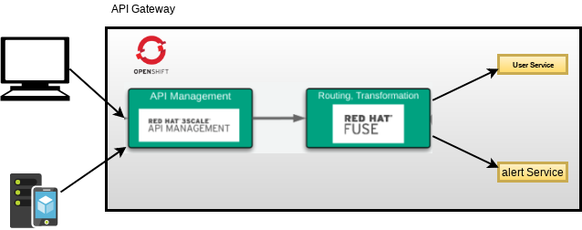
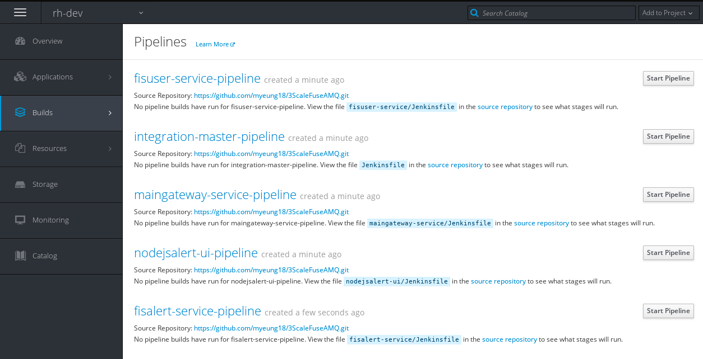
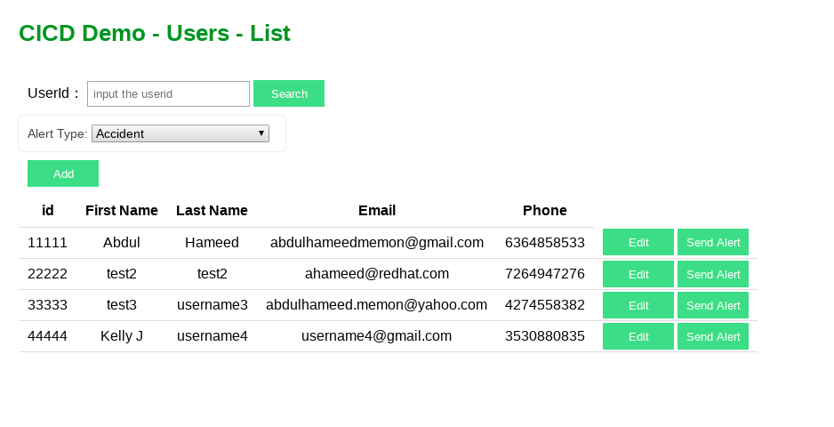

# IntegrationApp Automation


## Demo Story

An integration application consisting of Multiple services working in combination (single front end with dispatch to two back-ends), one or more APIs that need to be managed via 3scale, and one or more messaging destinations/addresses used for event-driven inputs and outputs. Now want to automate deployment of this application across multiple environments, using pre-defined pipelines provided by the platform. The delivery pipelines must support environment-specific properties, testing, versioning, and the ability to rollback incomplete or failed deployments.




**Products and Projects**

    • OpenShift Container Platform
    • Red Hat 3scale API Management
    • Red Hat Fuse
    • MySQL Database
    • Red Hat AMQ
    • Node.js (RHOAR) Web Application
    • Jenkins for CICD





 Steps
 
     • Design an application using Fuse, AMQ, and 3Scale.
     • Source to Image (S2I) build and deploy apps on openshift environment.
     • Building a pipeline to support automated CI/CD
     • Expose a REST API using Camel, and export API doc to swagger.
     • Publish API on 3scale environment using 3scaletoolbox jenkins pipeline.
     • Manage the API through 3scale API management and update the application plan to rate-limit the application.
     • Design a web application that makes its calls through the 3scale API gateway.

## Application Environment

This demo contains below applications.

   1. [Gateway application](https://github.com/rh-integration/IntegrationApp-Automation/tree/master/maingateway-service).
   2. [User Service application ](https://github.com/rh-integration/IntegrationApp-Automation/tree/master/fisuser-service)
   3. [Alert Service Application ](https://github.com/rh-integration/IntegrationApp-Automation/tree/master/fisalert-service)
   4. [Node.js Web application](https://github.com/rh-integration/IntegrationApp-Automation/tree/master/nodejsalert-ui)
   5. [3scale Toolbox Jenkins Pipeline](https://github.com/rh-integration/IntegrationApp-Automation/tree/master/cicd-3scale).
     


## Automation of Applications in OpenShift
### Build and deploy with pipelines
***The application works under [OpenShift](https://www.okd.io/) or [Minishift](https://www.okd.io/minishift/)***

The following instructions assuming that you are using OpenShift. But the same could be applied to Minishift as well.

Download the source codes from git repository by either forking, or simply cloning it. 

```
git clone https://github.com/rh-integration/IntegrationApp-Automation.git 

```
Assume you have OpenShift cluster ready and running.

```
# login to the OpenShift
oc login <OpenShift cluster url> --token=<OpenShift user login token>

```

Setup `rh-dev`, `rh-test` and `rh-prod` OpenShift projects as the target environment (you may skip this step if you already have the environment ready, and you can also change projects name inside env.sh ).
    
```sh

./setup/setup.sh

```
If you run the above setup.sh, the pipelines are automatically imported. In case you want to further customize the pipelines, please follow the instructions below.

You can also customize the pipelines by changing their parameters.  Different templates have different parameters but they are all listed below:

```
Parameters           Default                            Explanations
GIT_REPO             https://github.com/rh-integration/IntegrationApp-Automation.git
GIT_BRANCH           master                             #git branch where you want to build
OPENSHIFT_HOST       <leave it for now, will be used in future release>
OPENSHIFT_TOKEN      <leave it for now, will be used in future release>
DEV_PROJECT          rh-dev
TEST_PROJECT         rh-test
PROD_PROJECT         rh-prod
MYSQL_USER           dbuser                             #your DB user account
MYSQL_PWD            password                           #DB user password
IMAGE_REGISTRY       docker-registry.default.svc:5000   #image registry, typically the docker registry service of your OpenShift environment
IMAGE_NAMESPACE      rh-dev                             #the OpenShift project/namespace where you built and pushed the image

* If you have customized MYSQL_USER or MYSQL_PWD, please edit the nodejsalert-ui/config.js accordingly.

```
##### To list the parameters of each template:
```sh

# list for fisuser-service pipeline
oc process --parameters -f fisuser-service/src/main/resources/pipeline-app-build.yml

# list for maingateway-service pipeline
oc process --parameters -f  maingateway-service/src/main/resources/pipeline-app-build.yml

# list for nodejsalert-ui pipeline
oc process --parameters -f  nodejsalert-ui/resources/pipeline-app-build.yml

# list for fisalert-service pipeline
oc process --parameters -f  fisalert-service/src/main/resources/pipeline-app-build.yml

# list for aggregated-pipeline
oc process --parameters -f  pipelinetemplates/pipeline-aggregated-build.yml

```

##### To replace the existing pipelines with your customized pipelines:

```sh

##### switch to rh-dev project
oc project rh-dev

```

#### Remove the exisiting pipeline that you want to customize.

```sh

oc delete bc fisuser-service-pipeline
oc delete bc maingateway-service-pipeline
oc delete bc nodejsalert-ui-pipeline
oc delete bc fisalert-service-pipeline
oc delete bc aggregated-pipeline
oc delete bc publish-api-3scale

```

```sh

# import fisuser-service pipeline
oc new-app -f fisuser-service/src/main/resources/pipeline-app-build.yml -p IMAGE_REGISTRY=docker-registry.default.svc:5000 -p IMAGE_NAMESPACE=rh-dev -p DEV_PROJECT=rh-dev -p TEST_PROJECT=rh-test -p PROD_PROJECT=rh-prod

# import maingateway-service pipeline
oc new-app -f maingateway-service/src/main/resources/pipeline-app-build.yml -p IMAGE_REGISTRY=docker-registry.default.svc:5000 -p IMAGE_NAMESPACE=rh-dev -p DEV_PROJECT=rh-dev -p TEST_PROJECT=rh-test -p PROD_PROJECT=rh-prod

# import nodejsalert-ui pipeline
oc new-app -f nodejsalert-ui/resources/pipeline-app-build.yml -p IMAGE_REGISTRY=docker-registry.default.svc:5000 -p IMAGE_NAMESPACE=rh-dev -p DEV_PROJECT=rh-dev -p TEST_PROJECT=rh-test -p PROD_PROJECT=rh-prod

# import fisalert-service pipeline
oc new-app -f fisalert-service/src/main/resources/pipeline-app-build.yml -p IMAGE_REGISTRY=docker-registry.default.svc:5000 -p IMAGE_NAMESPACE=rh-dev -p DEV_PROJECT=rh-dev -p TEST_PROJECT=rh-test -p PROD_PROJECT=rh-prod

# import aggregated-pipeline
oc new-app -f pipelinetemplates/pipeline-aggregated-build.yml -p IMAGE_REGISTRY=docker-registry.default.svc:5000 -p IMAGE_NAMESPACE=rh-dev -p DEV_PROJECT=rh-dev -p TEST_PROJECT=rh-test -p PROD_PROJECT=rh-prod 

# import 3scale pipeline
oc new-app -f cicd-3scale/3scaletoolbox/pipeline-template.yaml  -p IMAGE_NAMESPACE=rh-dev -p DEV_PROJECT=rh-dev -p TEST_PROJECT=rh-test -p PROD_PROJECT=rh-prod 


```

After you have imported all of the pipeline templates, you should have them under `Builds`, `Pipelines` of the selected OpenShift project.



Please start the pipeline from `maingateway-service-pipeline`, `fisuser-service-pipeline`, `fisalert-service-pipeline`, `nodejsalert-ui-pipeline` and then `publish-api-3scale` to publish API on 3scale.

With `aggregated-pipeline`, you can build the entire application including all of the above modules mentioned. If you choose this pipeline, by default, it will build the entire application, but you will also be asked to select which individual module you want to bulid.  You will need to make your selection in your Jenkins console.

Once the build is finished, in your OpenShift, go to `rh-test` or `rh-prod`, nevigate to `Applications`, `Routes` and click on maingateway-service and nodejsalert-ui URL to launch the application.
You should see the application and it is started with web front-end like this: 




### In-process Script Approval & 3scale pipeline setup

Before running `Pipelines `, please read the following instructions.


* In Jenkins 2, running script in pipeline are subject to script security check (this issue will be faced with smoke test step script), and the script has to be approved before it is allowed to run.  When you start to run ` Pipelines`, you mostly will encounter "Scripts not permitted to use method ... " exceptions. If this happens, please login Jenkins as an administrator, go to "Manage Jenkins", "In-process Script Approval" page to approval the script.  You may need to do the approval multiple times as we found that Jenkins does the check on method level.  You only need to approve once on all those methods during the first run.  We suggest you to use persistent storage enabled Jenkins pod so that your approvals can be saved and reloaded if pod is restarted.

* Create the routes for your APIcast gateways in 3scale Project if required with below command

```sh
oc new-app -f apicast-routes-template.yaml -p BASE_NAME=3scalefuse -p WILDCARD_DOMAIN=<openshift_wildcard_domain> -n <3scale_namespace>
```

* Read [3scaletoolbox Configuration](cicd-3scale/README.md)

### Deploy with BlueGreen Deployment Strategy

The following instructions show how to use Jenkins Pipeline to deploy `nodejsalert-ui` module with BlueGreen Deployment Strategy.

We will work with `nodejsalert-ui-pipeline`.  Please login to Jenkins console in your OpenShift. Then you should see the pipeline job `rh-dev/nodejsalert-ui-pipeline`.  Click on it and next click on the `Build with Parameters`.  In the parameters input page, input the `SERVICE_VERSION`, check the checkbox for `BLUEGREEN_DEPLOYMENT`, and validate other parameters (default should work if you followed all the instructions in this page). Click on Build button to start the build.

After the build is finished. You should be able to see `nodejsalert-ui-green` services in your `rh-test` as well as `rh-prod` OpenShift projects.  Now you can change your existing nodejsalert-ui route to point to this Green service so that you can verify your new deployment before completely rollout to production. 


```
#To change the route to use Green release
oc patch route/nodejsalert-ui -p  '{"spec":{"to":{"name":"nodejsalert-ui-green"}}}' -n rh-test

#To rollback the deployment (if necessary)
oc patch route/nodejsalert-ui -p  '{"spec":{"to":{"name":"nodejsalert-ui"}}}' -n rh-test

```
###  Cleanup

delete all projects run below command 
```sh
 ./setup/delete-setup.sh
 
 ```
