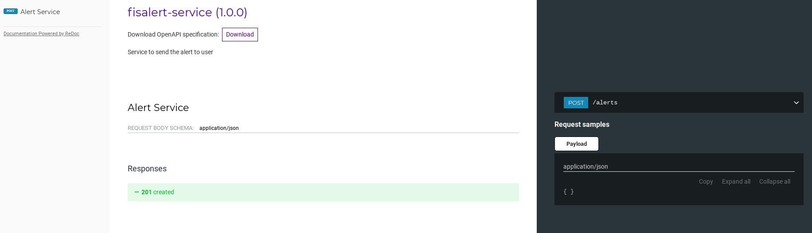
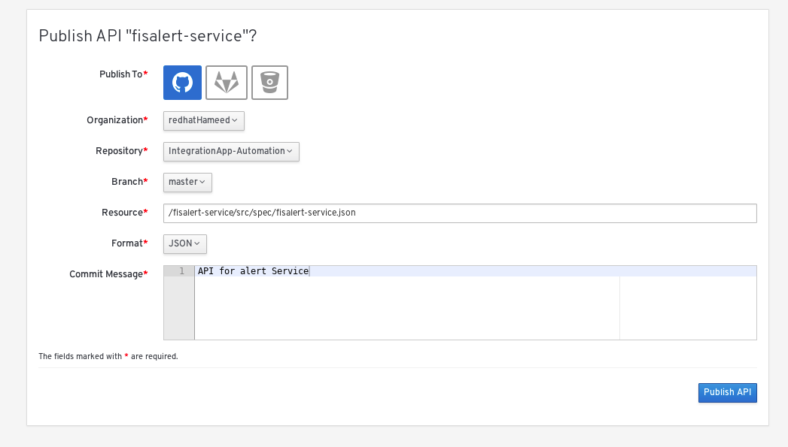
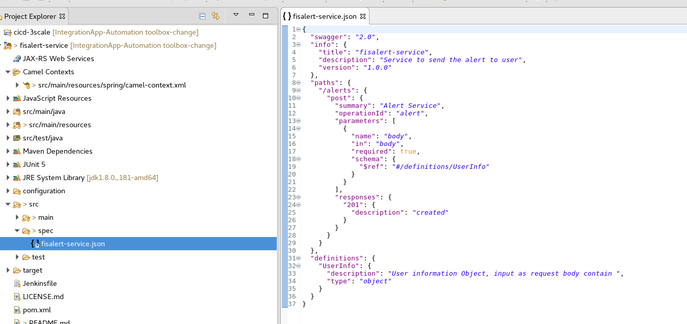
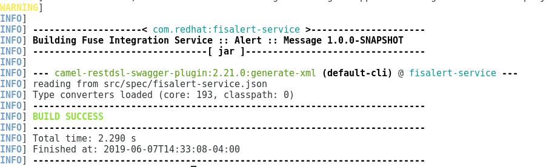
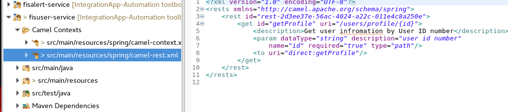

#  User alert - Service 

This Project demonstrates how to use Apicurio to design API and integrate a Spring-Boot application to an ActiveMQ broker and use JMS messaging between two Camel routes using OpenShift.


  
### Defining the Application with the OpenAPI Specification in Apicurio  

Create the API (service).

 ")

Start adding the paths to the document.

 


Add parameters and define their type.

 
  

Add Request body and Define response 201

 


Preview API

  

Publish API on GitHub  
  
Add the generated API specification document to the directory src/spec/.

<p align="left">
  
</p>


###  Integrate the Standard API Document with Red Hat Fuse


I used Red Hat Developer Studio and generate New->Fuse Integration Project and given name 'fisalert-service'

We are going to use a microservices approach, so select the most-popular runtime—Spring Boot. 

My generated API specification document saved under directory src/spec/
  
  
  <p align="left">
  
 </p>

Edit the pom.xml file, and add the following to it:

```xml

<plugins>
....
<plugin>
  <groupId>org.apache.camel</groupId>
  <artifactId>camel-restdsl-swagger-plugin</artifactId>
  <version>2.21.0</version>
  <configuration>
    <specificationUri>src/spec/fisalert-service.json</specificationUri>
    <fileName>camel-rest.xml</fileName>
    <outputDirectory>src/main/resources/spring</outputDirectory>    
  </configuration>
</plugin>
....
</plugin>

```

Generate the XML by running the following in the command-line tool:  

```
mvn camel-restdsl-swagger:generate-xml

```
<p align="left">
  
</p>


You will then find a newly generated Camel context named camel-rest.xml, which has all the path implementations in Camel.

<p align="left">
  
</p>


From that file, copy everything inside the < rests > tags and paste it into the original camel-context.xml file inside camelContext. Add the following rest configuration on top of the rest block

```xml

  <camelContext id="camel" xmlns="http://camel.apache.org/schema/spring">
        <restConfiguration apiContextPath="api-docs" bindingMode="json"
            component="servlet" contextPath="/cicd" enableCORS="true">
            <apiProperty key="cors" value="true"/>
            <apiProperty key="api.title" value="Alert Service"/>
            <apiProperty key="api.version" value="1.0.0"/>
            <apiProperty key="cors" value="true"/>
            <apiProperty key="api.title" value="FIS Gateway"/>
            <apiProperty key="api.version" value="1.0.0"/>
        </restConfiguration>
        <rest id="rest-137a1c4f-a95b-4701-9550-5c4c829b6931" path="/">
            <post id="alert" uri="/alerts">
            <param name="body" required="true" type="body"/>
            <to uri="direct:alert"/>
        </post>
        </rest>
        <route id="_Alert Service">
            <from id="report" uri="direct:alert"/>
            <log id="log-body" message="${body}"/>
        </route>
    </camelContext>
        
  ```
  
Delete the generated camel-rest.xml file.
 


### Building

The example can be built with

    mvn clean install

### Testing the API locally

Using Red Hat Developer Studio

In Project Explorer, select a routing context file.

Right-click it to open the context menu, and then select Run As → Local Camel Context.

or can be run locally using the following Maven goal:


    mvn spring-boot:run


url: 

http://localhost:8080/cicd/alerts

post params :

```json

{
  "alertType": "WEATHER",
  "firstName": "test",
  "date": "11/8/2019",
  "phone": "1234567",
  "email": "< with your email addresses >,
  "description": "test alert service"
}

```
view the API Doc       
   
   - <http://localhost:8080/cicd/api-docs>    
    
### Implemention


This service sends an email alert and exposes an API endpoints, by receiving input as JSON. This content is later sent to a messaging broker, and then picked up by a bean, which simply processes email parameters and returns a result of the email status.


  

Email Conifg:

 - Update src/main/resources/application.yml with email server configuration.
 - Insert your email credentials, we are using GMAIL as example.


### Running the example in OpenShift

It is assumed that:
- OpenShift platform is already running, if not you can find details how to [Install OpenShift at your site](https://docs.openshift.com/container-platform/3.3/install_config/index.html).
- Your system is configured for Fabric8 Maven Workflow, if not you can find a [Get Started Guide](https://access.redhat.com/documentation/en/red-hat-jboss-middleware-for-openshift/3/single/red-hat-jboss-fuse-integration-services-20-for-openshift/)

The example can be built and run on OpenShift using a single goal:

    mvn fabric8:deploy

When the example runs in OpenShift, you can use the OpenShift client tool to inspect the status

To list all the running pods:

    oc get pods

Then find the name of the pod that runs this quickstart, and output the logs from the running pods with:

    oc logs <name of pod>

You can also use the OpenShift [web console](https://docs.openshift.com/container-platform/3.3/getting_started/developers_console.html#developers-console-video) to manage the
running pods, and view logs and much more.

### Running via an S2I Application Template

Application templates allow you deploy applications to OpenShift by filling out a form in the OpenShift console that allows you to adjust deployment parameters.  This template uses an S2I source build so that it handle building and deploying the application for you.

First, import the Fuse image streams:

    oc create -f https://raw.githubusercontent.com/jboss-fuse/application-templates/GA/fis-image-streams.json

Then create the quickstart template:

    oc create -f https://raw.githubusercontent.com/jboss-fuse/application-templates/GA/quickstarts/spring-boot-camel-template.json

Now when you use "Add to Project" button in the OpenShift console, you should see a template for this quickstart. 

