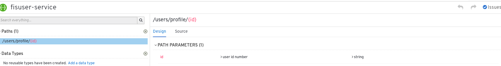
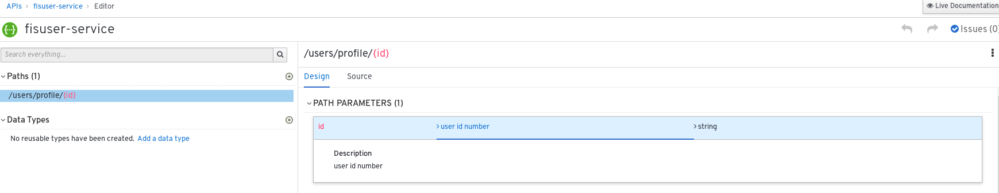
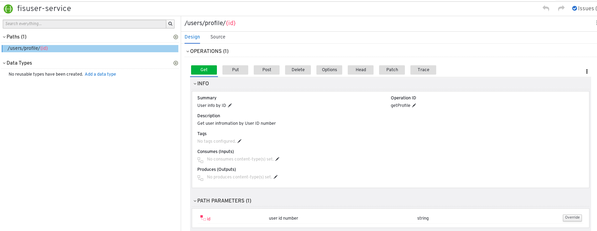
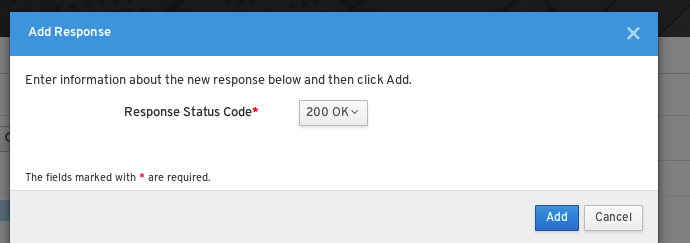
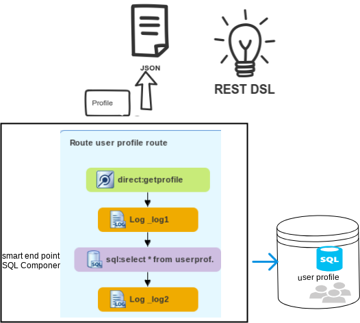

# User Profile Service

This demo demonstrates how to use Apicurio for design OpenAPI using contract-first approach along with Red Hat Fuse/Camel's and generate the Red Hat Fuse project and use REST DSL to expose a RESTful API.

This example relies on the Fabric8 Maven plugin for its build configuration and uses the FIS Java base image

### API Curio setup 

- you can add Apicurito as a service to your OpenShift project by following the [link](/setup/adding_apicurito_as_a_service_ocp.md)
  
### Design and develop an API definition with Apicurito

Open apicurito route and Click New API.
                             
change the API name: Hover the cursor over the name and then click the edit icon (  apicurito pencil ) that appears.
Edit the name as ```fuse-user-service```, Click Save.                             

 ")

Start adding the paths to the document.

 


Add parameters and define their type.

 
  

Add Operation

 


Add responses

 


Save API 
  
Click Save As → Save as JSON.

The JSON file is downloaded to your local download folder. The default filename is openapi-spec, rename it as a ``userservice-spec.json``

For more detail follow the [blog](https://access.redhat.com/documentation/en-us/red_hat_fuse/7.2/html-single/designing_apis_with_apicurito/index#p_creating_api_create-api-definition)

###  Generate / Integrate a Fuse Camel project from Apicurito

You can use Apicurito to generate a Fuse Camel project based on an API definition. By following below steps

1. Select the OpenAPI definition ```userservice-spec.json``` file and then click Open.  
2. The OpenAPI definition opens in the Apicurito console. Click Generate.
2. Select Fuse Camel Project from the drop-down list.
3. Apicurito generates a camel-project.zip file and downloads it to your local default download folder and Unzip it .
4. used Red Hat Developer Studio or other tool and Import  Maven Projects.
5. Open the project’s camel-context.xml file in the editor view. Click the REST tab to edit the Rest DSL components.


### Mocking the APIs with Apache Camel

add a beans.xml file by right-clicking the folder and selecting New->beans.xml File.

Insert the following code snippet to the beans.xml file:

```xml
<?xml version="1.0" encoding="UTF-8"?>
<beans xmlns="http://www.springframework.org/schema/beans"
 xmlns:util="http://www.springframework.org/schema/util"
    xmlns:xsi="http://www.w3.org/2001/XMLSchema-instance" xsi:schemaLocation="        
    http://www.springframework.org/schema/beans http://www.springframework.org/schema/beans/spring-beans.xsd        
    http://camel.apache.org/schema/spring       http://camel.apache.org/schema/spring/camel-spring.xsd

    http://www.springframework.org/schema/util http://www.springframework.org/schema/util/spring-util.xsd">
<util:list id="UserProfileList" list-class="java.util.ArrayList">
   <ref bean="UserProfile"/>
</util:list>
<util:map id="UserProfile" map-class="java.util.HashMap">
   <entry key="firstName" value="Abdul"/>
   <entry key="lastName" value="Hameed"/>
   <entry key="email" value="xyz@gmail.com"/>
   <entry key="phone" value="12345678"/>
   <entry key="addr" value="28 st town state zipcode "/>
   <entry key="state" value="MA"/>

</util:map>
</beans>
```

Add the Camel routes to the camel-context.xml file.

```xml
        <route id="user profile route">
            <from id="_from1" uri="direct:getProfile"/>
            <log id="_log1" message="Profile ${headers.id}"/>
             <to uri="bean:UserProfileList?method=get(0)"/>
            <log id="_log2" message="output: ${body}"/>
        </route>
```

        

### Building

The example can be build with

```
    mvn clean install

 ```
    
    
### Running the example locally


can be run locally using the following Maven goal:

```
   $ mvn spring-boot:run
    
```
You can then access the REST API directly from your Web browser, e.g.:

   -  curl http://localhost:8080/cicd/users/profile/11111
   
 ```json
   
   {"firstName":"Abdul","lastName":"Hameed","phone":"12345678","state":"MA","addr":"28 st town state zipcode ","email":"xyz@gmail.com"}
   
 ```
  
   - Getting the API docs:
     
    curl http://localhost:8080/cicd/openapi.json
    
### Implementation 
        

This is a Fuse Service that use SQL component to connect to a table in database, that retrieves particular user profile by providing the profile id and return out as a JSON format.

  


This uses an embedded in-memory HSQLDB database. You can use the default Spring Boot profile in case you have a MySQL server available for you to test.

You can then access and verify the data from database, user id should be available in database .:


- <http://localhost:8080/cicd/user/profile/11111>   

### Running the example in OpenShift

It is assumed that:
- OpenShift platform is already running, if not you can find details how to [Install OpenShift at your site](https://docs.openshift.com/container-platform/3.3/install_config/index.html).
- Your system is configured for Fabric8 Maven Workflow, if not you can find a [Get Started Guide](https://access.redhat.com/documentation/en/red-hat-jboss-middleware-for-openshift/3/single/red-hat-jboss-fuse-integration-services-20-for-openshift/)

The example can be built and run on OpenShift using a single goal, the mysql database should already setup in your environment see the setup.sh file inside setup dir for more details

   ```
   mvn fabric8:deploy -Dmysql-service-username=dbuser -Dmysql-service-password=password
  ```

When the example runs in OpenShift, you can use the OpenShift client tool to inspect the status

To list all the running pods:

    oc get pods

Then find the name of the pod that runs this quickstart, and output the logs from the running pods with:

    oc logs <name of pod>

You can also use the OpenShift [web console](https://docs.openshift.com/container-platform/3.3/getting_started/developers_console.html#developers-console-video) to manage the
running pods, and view logs and much more.

### Running via an S2I Application Template

Application templates allow you deploy applications to OpenShift by filling out a form in the OpenShift console that allows you to adjust deployment parameters.  This template uses an S2I source build so that it handle building and deploying the application for you.

First, import the Fuse image streams:

    oc create -f https://raw.githubusercontent.com/jboss-fuse/application-templates/GA/fis-image-streams.json

Then create the quickstart template:

    oc create -f https://raw.githubusercontent.com/jboss-fuse/application-templates/GA/quickstarts/spring-boot-camel-template.json

Now when you use "Add to Project" button in the OpenShift console, you should see a template for this quickstart. 

